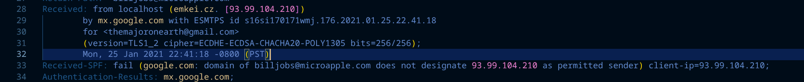
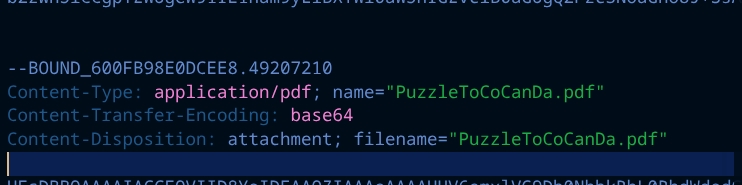
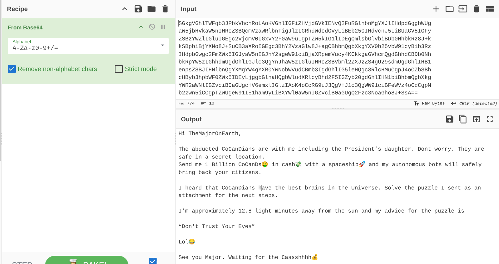
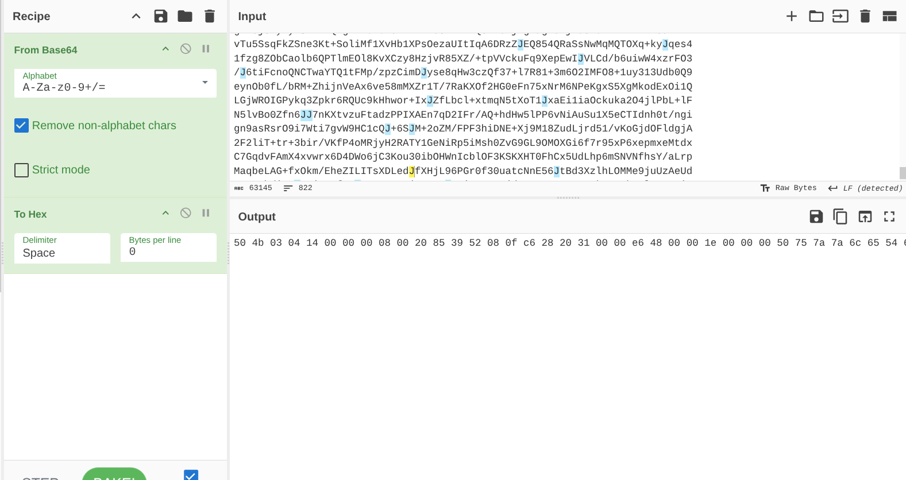
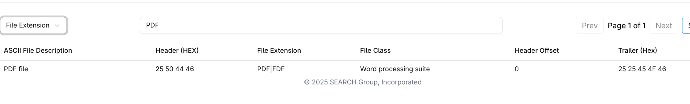
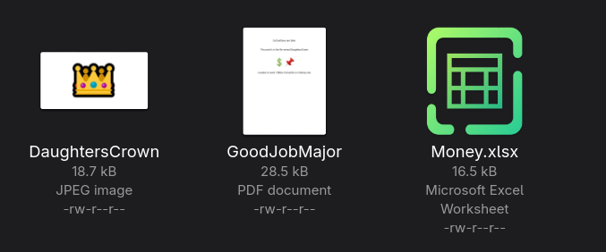
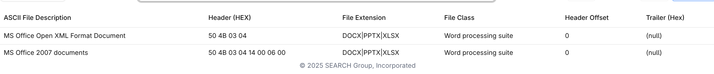
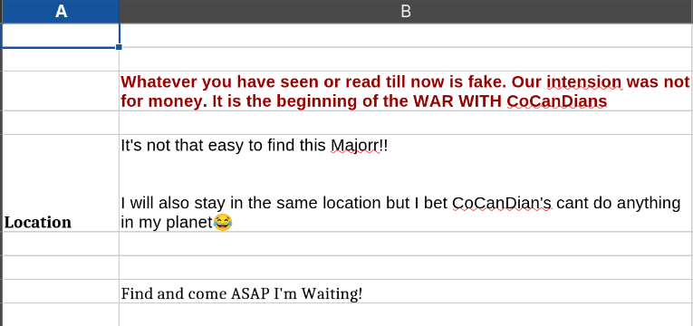

# BTLO: The Planet's Prestige


This walkthrough documents a phishing-email investigation for
[The Planet's Prestige](https://blueteamlabs.online/home/challenge/the-planets-prestige-e5beb8e545)
on Blue Team Labs Online (BTLO). It follows the analysis from the arrival of
the message through header triage, MIME inspection, attachment validation, and
the clues found in the extracted files.

- **Scenario:** CoCanDa's president receives a ransom email after his daughter
  and other citizens disappear.
- **Evidence:** [`A Hope to CoCanDa.eml`](./A%20Hope%20to%20CoCanDa.eml)
- **Related files:** [`attachment.zip`](./attachment.zip) and the extracted
  [challenge files](./PuzzleToCoCanDa/)
- **Question-by-question answers:** [answers.md](./answers.md)
- **Video reference:** [MyDFIR walkthrough](https://www.youtube.com/watch?v=k7HeshxhwPk)

Unless noted otherwise, run the shell commands from the `Warm-Up/BTLO/`
directory.

> **Safety:** Treat the message and all attachments as untrusted. Analyze
> copies, do not enable macros or active content, and do not open extracted
> files on a production system. The included screenshots and notes document
> observations from the lab.

## Investigation workflow

### 1. Preserve the message and establish context

Start with the original `.eml` file. Keep it unchanged as evidence and use a
working copy for analysis. The message claims that the sender has abducted
CoCanDa's citizens and asks for a ransom; its text also directs the recipient
to solve a puzzle in the attachment.

Email investigations work best when observations are recorded as evidence
before they are treated as conclusions. A display name, a failed authentication
check, or a suspicious attachment is a lead to investigate—not, by itself,
proof of who sent a message or why.

### 2. Triage the headers and authentication results

Review the sender, reply destination, transport trace, and authentication
results together:

```shell
grep -iE '^(From|Reply-To|Return-Path|Received|Received-SPF|Authentication-Results):' \
  'A Hope to CoCanDa.eml'
```

The message displays `Bill <billjobs@microapple.com>` as its sender but sets
`Reply-To` to `negeja3921@pashter.com`. The receiving provider's trace records a
connection from `emkei.cz` at `93.99.104.210`, and its SPF result is `fail` for
`billjobs@microapple.com`.



These are suspicious inconsistencies that merit further investigation. SPF
failure means the receiving system did not find the connecting IP authorized
by the sender domain's SPF policy; it does not, on its own, prove malicious
intent or identify the person behind the email. The visible
`Authentication-Results` records SPF failure. This message does not show a
DKIM signature or a DKIM/DMARC result, which is different from proving that
the sender's domain has no DKIM or DMARC configuration.

`Received` fields are added by mail servers as a message travels. Read the
trace from bottom to top to follow its apparent path, but give the most weight
to entries added by systems you trust: earlier lines can be supplied or
manipulated by the sender.

### 3. Inspect the MIME structure and decode the message body

The message declares `multipart/mixed`, meaning it contains multiple MIME
parts separated by a boundary. In this sample, the first part is plain text
encoded with Base64, and the following part is an attachment.



Base64 is a text representation for transporting bytes; it is not encryption.
Decoding the first part reveals the ransom note and the instruction
“Don't Trust Your Eyes.”



The decoded body is also saved as [`body.txt`](./body.txt).

### 4. Validate the attachment instead of trusting its filename

The attachment headers label the file as `application/pdf` and
`PuzzleToCoCanDa.pdf`. A filename and MIME content type are supplied metadata,
so validate them against the file's contents. After decoding the attachment
payload, inspect its signature:



The leading bytes `50 4B 03 04` are a ZIP local-file signature, not a PDF
signature. A PDF normally begins with `%PDF` (`25 50 44 46` in hexadecimal).
The ZIP signature alone does not distinguish a regular ZIP archive from
ZIP-based formats such as Office documents; inspect the archive contents too.



List archive entries before extracting them:

```shell
unzip -l attachment.zip
```

The challenge archive contains `DaughtersCrown`, `GoodJobMajor`, and
`Money.xlsx`. Their names alone do not establish file types; the file headers
and internal structure provide stronger evidence.



For this lab, the supplied extracted files are in
[`PuzzleToCoCanDa/`](./PuzzleToCoCanDa/). The spreadsheet's internal ZIP
contents confirm that it is an Excel workbook:



### 5. Examine document metadata and hidden spreadsheet content

Metadata can provide investigative leads, but it is not guaranteed to be
accurate or attributable. The PDF's `Author` metadata contains a name that
answers one of the lab questions:

```shell
exiftool PuzzleToCoCanDa/GoodJobMajor.pdf
```

The spreadsheet also contains a second sheet that appears blank at first.
Inspect hidden content carefully; the lab notes record Base64 text found there.
Decoding it reveals a location:

```text
The Martian Colony, Beside Interplanetary Spaceport.
```




### 6. Correlate the clues and record answers

The main clues are the mismatch between `From` and `Reply-To`, the receiving
server's SPF failure, the suspicious sending-service host, the attachment
whose declared PDF type conflicts with its ZIP signature, and the metadata and
encoded spreadsheet content. Interpret these clues together; avoid treating
any single field as conclusive attribution.

For the concise question-by-question answer record, supporting observations,
and answer formats, see [answers.md](./answers.md).

## Key technical terms

| Term | Meaning in this investigation |
| --- | --- |
| `From` / `Reply-To` | `From` is the displayed author field; `Reply-To`, when present, supplies the reply destination. A mismatch deserves review. |
| `Received` | A mail-server trace field. Trusted receiving-server entries help show the route a message took. |
| SPF | A domain-published policy used to check whether a sending IP is authorized for a domain. A failure is a signal to investigate, not a verdict by itself. |
| DKIM / DMARC | Email-authentication mechanisms and policy/reporting. Missing results in one message do not establish that a domain has no policy configured. |
| MIME boundary | A delimiter separating the parts of a multipart email, such as the text body and an attachment. |
| Base64 | A way to encode bytes as text for transport; it provides no confidentiality. |
| Magic bytes / file signature | Leading bytes that can help identify a file's actual format independently of its extension or declared MIME type. |
| Metadata | Descriptive fields embedded in a file; useful as a lead, but not proof of authorship. |
| C2 | Command and control: infrastructure an operator may use to communicate with compromised systems. A domain suggested by an email clue is only a lead until corroborated. |
