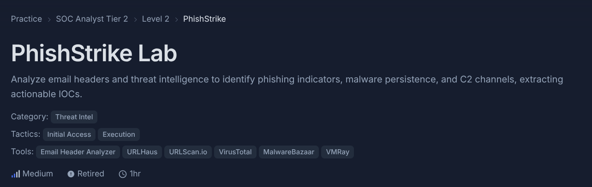
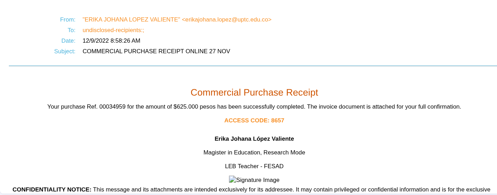
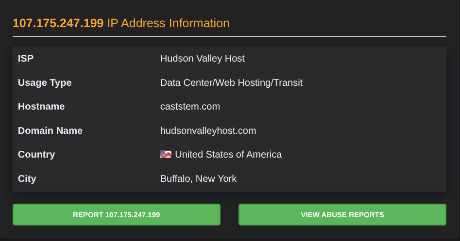
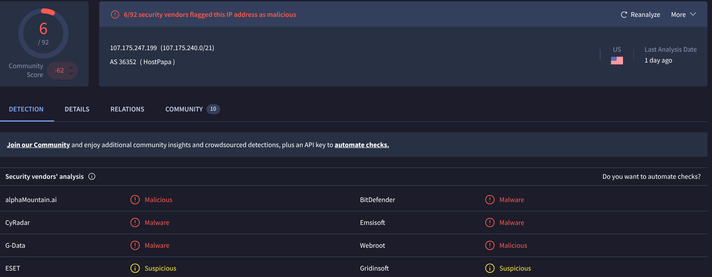

# CyberDefenders: PhishStrike



This case study documents the
[PhishStrike challenge](https://cyberdefenders.org/blueteam-ctf-challenges/phishstrike/)
from CyberDefenders. The scenario involves an email to an educational
institution that claims a purchase of 625,000 pesos and urges the recipient
to open an invoice link.

- **Evidence:** [`194-PhishStrike.eml`](./194-PhishStrike.eml)
- **Extracted HTML part:** [`html.html`](./html.html)
- **Question-by-question notes:** [answers.md](./answers.md)
- **Related reference:** [CoinMiner notes](./miner.md)
- **Challenge walkthrough:** [CyberDefenders PhishStrike walkthrough](https://cyberdefenders.org/walkthroughs/phishstrike/)
- **Additional write-up:** [PhishStrike write-up](https://medium.com/@GL1T0H/phishstrike-write-up-767d44fe3e97)

> **Safety:** Do not click or resolve the indicators in this report. Treat the
> email, its HTML, and all referenced payloads as untrusted. No malware was
> executed as part of these notes. Malware-family behavior and some IOC answers
> below are based on third-party sandbox or challenge reporting, not on
> detonation performed here.

## Investigation

### 1. Preserve the message and record its context

Keep the supplied `.eml` unchanged and perform inspection on a copy. The
message presents itself as a commercial purchase receipt, cites reference
`00034959`, and claims a purchase of `$625.000 pesos`. It provides an access
code and a link presented as an invoice download. An unexpected financial
claim paired with pressure to retrieve a file is a reason to investigate; it
is not, by itself, proof of maliciousness.

### 2. Read authentication and transport results as separate observations

The message displays the sender as
`ERIKA JOHANA LOPEZ VALIENTE <erikajohana.lopez@uptc.edu.co>` and the
`Return-Path` uses the same address. Microsoft records the following results:

```text
spf=softfail (sender IP is 18.208.22.104)
dkim=fail (no key for signature)
dmarc=none
```

The connecting IP at Microsoft's receiving edge is `18.208.22.104`, which is
also the IP asked for in the first challenge question. Earlier in the trace,
Trend Micro records receipt from `209.85.221.65` and reports different
authentication results. These observations come from different points in the
mail path and should not be collapsed into a single verdict.

- **SPF softfail** means the receiving system's SPF evaluation did not
  establish the connecting IP as an authorized sender under the result shown.
  Here, the receiver evaluated the Trend Micro relay IP; an intermediary can
  change the IP seen by the next receiver.
- **DKIM fail (no key)** is the result recorded by Microsoft for the
  `uptc.edu.co` signature. The available headers do not establish why the key
  lookup failed.
- **DMARC none** means the receiving system reports no DMARC policy/result to
  apply for this message. It does not prove maliciousness.
- **ARC** records authentication results from intermediary hops and signs a
  chain of those records. Trend Micro's seal has `cv=none` (no previous ARC
  set), while Microsoft's later seal has `cv=fail`. The headers show the
  validation outcome, but do not establish its cause. Do not infer which
  header or body change caused the failure from `cv=fail` alone.

The differing results are evidence to preserve and interpret alongside the
rest of the message. They are not proof that the sender is legitimate, nor do
they independently identify the person who sent it.

### 3. Compare the plain-text and HTML message parts

The email is `multipart/alternative`: it contains plain-text and HTML
representations of the message. An email client generally displays one
representation; the HTML part can format content and attach a hyperlink to
text that looks innocuous. Inspect both parts as data rather than clicking
links or loading remote content.

The plain-text part states that an invoice is ready. The HTML part also
contains a link to the same executable download. The extracted HTML is
available in [`html.html`](./html.html).



### 4. Record and defang the message's URL indicators

The email points to the following HTTP URL. It is shown here defanged so it
cannot be opened accidentally:

```text
hxxp://107[.]175[.]247[.]199/loader/install[.]exe
```

The IP address `107.175.247.199` is the host asked for in the third challenge
question. `install.exe` is a high-risk executable presented as an invoice.
The email itself establishes the URL and file name, not what the downloaded
program does.

The evidence folder contains screenshots of URL and host lookups:






External intelligence associates the infrastructure with multiple reported
payloads, including BitRAT, AsyncRAT, and CoinMiner. This is third-party
reporting and may vary by time, scanner, and sample; it should not be read as
proof that every payload was delivered to a recipient of this email.

### 5. Separate email evidence from follow-on malware analysis

Questions 4–11 shift from the email itself to behavior attributed to malware
samples or URLs by public analyses. The supplied email does not contain those
samples, and these notes do not execute them. The question file records which
answers came from the local email, screenshots, a challenge write-up, or
external sandbox reporting—and flags any answer that remains unverified.

Key reported follow-on indicators include:

| Indicator | Value | Evidence status |
| --- | --- | --- |
| Initial downloader | `hxxp://107[.]175[.]247[.]199/loader/install[.]exe` | Present in the email |
| BitRAT loader URL | `hxxp://107[.]175[.]247[.]199/loader/server[.]exe` | Shown in the supplied sandbox screenshot |
| Reported CoinMiner URL | See the discrepancy note in [answer 5](./answers.md#5-what-url-does-the-coinminer-request) | External reports disagree |
| Reported persistence name | `Jzwvix.exe` | Attributed to external sandbox analysis; screenshot shows a Run key named `Jzwvix` |
| Reported BitRAT SHA-256 | `bf7628695c2df7a3020034a065397592a1f8850e59f9a448b555bc1c8c639539` | Shown in external-analysis evidence |
| PowerShell delay | 50 seconds | Decoded from a command recorded in the analysis notes |
| BitRAT C2 domain | `gh9st[.]mywire[.]org` | Recorded answer; not independently reproduced |
| AsyncRAT Telegram bot ID | `5610920260` | Recorded answer; not independently reproduced |

Treat the malware-specific values as leads for detection and research, not as
proof that the email recipient's machine was infected.

### 6. Conclusion

The strongest findings directly supported by the email are the unexpected
purchase notice, the `install.exe` link over HTTP, and the authentication and
transport observations described above. These justify treating the message
and download as suspicious and escalating them through an appropriate
incident-response process.

The later malware details provide useful context, but rely on external reports
that are not fully reproducible from the supplied email alone. In particular,
the CoinMiner URL differs between the written challenge answer and the
provided sandbox screenshot. That discrepancy remains open rather than being
silently resolved.

For the answer-by-answer evidence and verification notes, see
[answers.md](./answers.md).

## Key terms

| Term | Meaning |
| --- | --- |
| SPF | A DNS-published policy used by a receiver to evaluate whether a connecting sender is authorized for a domain. |
| DKIM | A cryptographic signature that lets a receiver verify signed message content and the signing domain, if the public key is available. |
| DMARC | A domain policy that uses SPF/DKIM alignment and tells receivers how to handle authentication failures. |
| ARC | A signed chain for carrying authentication results across forwarding or other intermediary mail systems. |
| `cv` | The ARC chain-validation status recorded in an `ARC-Seal`, such as `none`, `pass`, or `fail`. |
| MIME | The format used to represent email content types and multiple message parts. |
| `multipart/alternative` | A MIME structure containing alternative representations of the same message, commonly plain text and HTML. |
| IOC | An indicator of compromise, such as a suspicious IP address, URL, domain, file hash, or persistence entry. |
| C2 | Command and control: infrastructure used by malware operators to communicate with compromised systems. |
