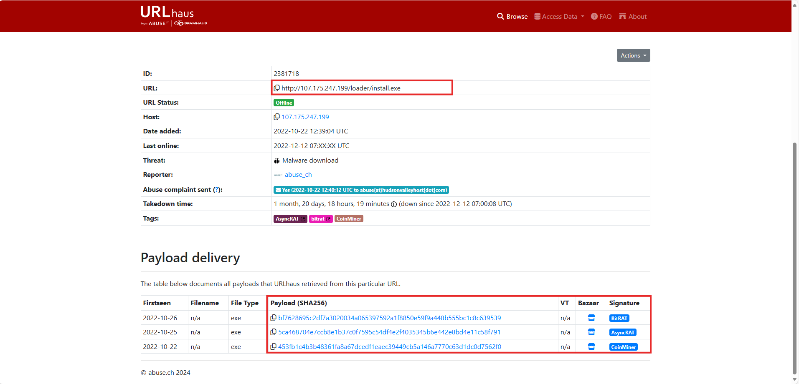
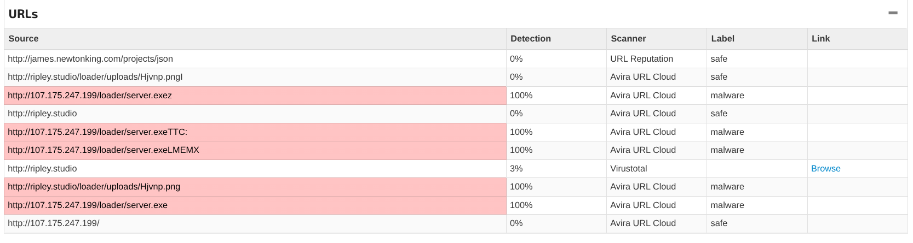
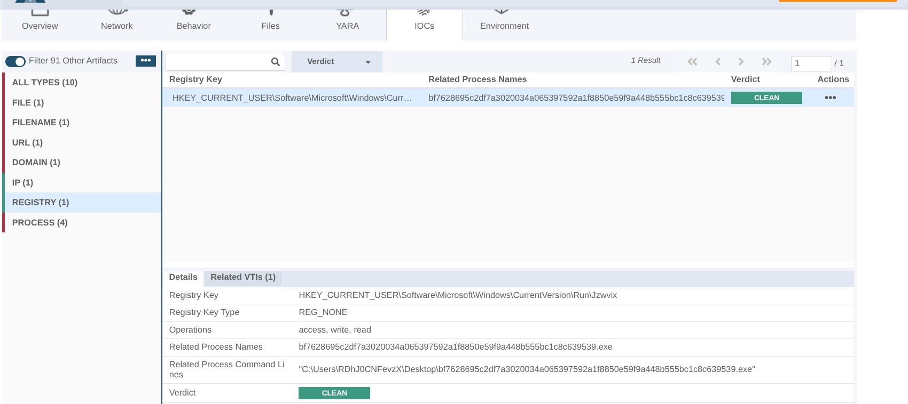

# PhishStrike: Questions, Answers, and Evidence

This file keeps the challenge questions and the evidence used to answer them.
For the chronological investigation and explanations of the email headers,
see the [PhishStrike walkthrough](./README.md).

## Answer status at a glance

| # | Topic | Recorded answer | Basis |
| --- | --- | --- | --- |
| 1 | SPF/DKIM sender IP | `18.208.22.104` | Directly in the supplied `.eml` |
| 2 | Return path | `erikajohana.lopez@uptc.edu.co` | Directly in the supplied `.eml` |
| 3 | Malicious download host | `107.175.247.199` | Directly in the supplied `.eml` |
| 4 | Cryptocurrency-mining malware | `CoinMiner` | External URLhaus/threat-intelligence evidence |
| 5 | URL requested by CoinMiner | See discrepancy below | Official challenge walkthrough; conflicts with screenshot |
| 6 | BitRAT autorun executable | `Jzwvix.exe` | External sandbox report; screenshot shows `Jzwvix` Run key |
| 7 | BitRAT SHA-256 | `bf7628695c2df7a3020034a065397592a1f8850e59f9a448b555bc1c8c639539` | External-analysis screenshot/report |
| 8 | URL used to retrieve BitRAT | `http://107.175.247.199/loader/server.exe` | Supplied sandbox screenshot |
| 9 | PowerShell delay | `50` seconds | Encoded command decoded in the notes |
| 10 | BitRAT C2 domain | `gh9st.mywire.org` | Recorded answer; not independently reproduced |
| 11 | AsyncRAT Telegram bot ID | `5610920260` | Recorded answer; not independently reproduced |

The malware-specific answers are not all verifiable from the email itself.
Their provenance and limitations are noted with each question. No sample was
executed as part of this analysis.

## 1. What is the sender's IP address with SPF `softfail` and DKIM `fail`?

Microsoft's `Authentication-Results` names the IP it evaluated:

```text
Authentication-Results: spf=softfail (sender IP is 18.208.22.104)
 smtp.mailfrom=uptc.edu.co; dkim=fail (no key for signature)
 header.d=uptc.edu.co; dmarc=none action=none
```

This is the IP seen by that receiving hop. Earlier in the chain, Trend Micro
reports a different connecting IP and different authentication results; see
[header triage in the walkthrough](./README.md#2-read-authentication-and-transport-results-as-separate-observations).

**Answer:** `18.208.22.104`

## 2. What is the return path specified in this email?

Inspect the `Return-Path` field in the supplied message:

```shell
grep -i '^Return-Path:' 194-PhishStrike.eml
```

```text
Return-Path: erikajohana.lopez@uptc.edu.co
```

The value matches the address in the `From` field in this sample. A match is
useful context, but it does not independently authenticate the sender.

**Answer:** `erikajohana.lopez@uptc.edu.co`

## 3. What is the IP address of the server hosting the malicious file?

The message's plain-text and HTML parts point to the same executable download:

```text
hxxp://107[.]175[.]247[.]199/loader/install[.]exe
```

The host component of that URL is the requested IP address. The email shows
the link; the claim that the host serves malware is supported by the related
threat-intelligence evidence, not by the URL alone.

**Answer:** `107.175.247.199`

## 4. Which malware family is responsible for cryptocurrency mining?

The URLhaus screenshot associates the URL's payloads with the labels BitRAT,
AsyncRAT, and CoinMiner. `CoinMiner` is the challenge answer for the
cryptocurrency-mining family. This classification comes from external
threat-intelligence reporting; the payload was not run locally.



See the short [CoinMiner reference](./miner.md).

**Answer:** `CoinMiner`

## 5. What URL does the CoinMiner request?

**Verification note:** The answer copied from the
[official PhishStrike walkthrough](https://cyberdefenders.org/walkthroughs/phishstrike/)
is:

```text
hxxp://ripley[.]studio/loader/uploads/Qanjttrbv[.]jpeg
```

However, the supplied sandbox screenshot shows a different URL under the same
`ripley.studio/loader/uploads/` path:

```text
hxxp://ripley[.]studio/loader/uploads/Hjvnp[.]png
```



These values do not match. The challenge answer below preserves the value
recorded from the official walkthrough, but the discrepancy remains unresolved
and should be checked against the challenge's current materials before treating
either URL as confirmed.

**Recorded answer (official walkthrough):**
`http://ripley.studio/loader/uploads/Qanjttrbv.jpeg`

## 6. What is the executable's name in the first autorun registry value added by BitRAT?

The notes identify `Jzwvix.exe` from an external VMRay report associated with
the sample hash in Question 7. The supplied registry screenshot shows a Run
key ending in `...\CurrentVersion\Run\Jzwvix`; it does not display the
`.exe` suffix in the key name. The executable name is therefore recorded from
the external analysis, while the screenshot independently supports the
`Jzwvix` persistence name.



**Recorded answer:** `Jzwvix.exe`

## 7. What is the SHA-256 hash of the file downloaded and added to autorun keys?

The hash recorded in the notes and associated with the BitRAT analysis is:

```text
bf7628695c2df7a3020034a065397592a1f8850e59f9a448b555bc1c8c639539
```

The available report link is
[VMRay IOC results](https://www.vmray.com/analyses/_vt/bf7628695c2d/report/ioc.html).
The hash is also visible in the supplied analysis screenshot:


**Answer:** `bf7628695c2df7a3020034a065397592a1f8850e59f9a448b555bc1c8c639539`

## 8. What URL does the loader use to retrieve BitRAT?

The Joe Sandbox report cited in the notes records the loader URL. The supplied
screenshot shows the same endpoint:

```text
hxxp://107[.]175[.]247[.]199/loader/server[.]exe
```


**Answer:** `http://107.175.247.199/loader/server.exe`

## 9. What delay does the PowerShell command introduce?

The encoded command in the notes is Base64-encoded UTF-16LE. Decode it as text
without executing the command:

```shell
printf '%s' 'UwB0AGEAcgB0AC0AUwBsAGUAZQBwACAALQBTAGUAYwBvAG4AZABzACAANQAwAA==' \
  | base64 --decode \
  | iconv -f UTF-16LE -t UTF-8
```

The result is:

```powershell
Start-Sleep -Seconds 50
```

A delay can affect automated analysis, but this command alone does not prove
why the delay was configured.

**Answer:** `50`

## 10. What is the BitRAT C2 domain?

The value recorded in the original notes is `gh9st.mywire.org`. It was not
independently reproduced from the email or the supplied evidence screenshots.
Treat it as an unverified, externally sourced challenge answer until a
specific supporting report or sample observation is available.

**Recorded answer:** `gh9st.mywire.org`

## 11. What Telegram Bot ID does AsyncRAT use?

The value recorded in the original notes is `5610920260`. It was not
independently reproduced from the email or the supplied evidence screenshots.
Treat it as an unverified, externally sourced challenge answer until a
specific supporting report or sample observation is available.

**Recorded answer:** `5610920260`

## Further reading

- [Official CyberDefenders walkthrough](https://cyberdefenders.org/walkthroughs/phishstrike/)
- [Additional PhishStrike write-up](https://medium.com/@GL1T0H/phishstrike-write-up-767d44fe3e97)
- [VMRay IOC report referenced in the original notes](https://www.vmray.com/analyses/_vt/bf7628695c2d/report/ioc.html)
- [Joe Sandbox analysis referenced in the original notes](https://www.joesandbox.com/analysis/730933/0/html)
