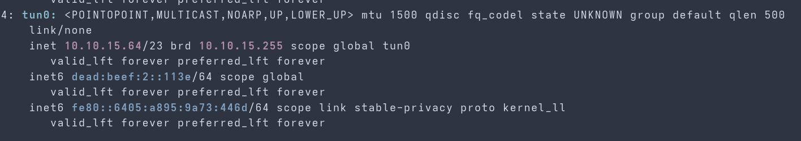
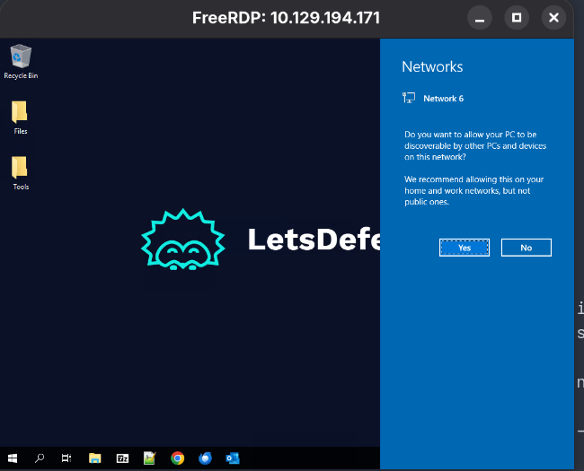

# Hack The Box: Phishing Email Analysis


This guide documents the hands-on work and notes for the
[Phishing Email Analysis module](https://academy.hackthebox.com/app/module/540)
on Hack The Box Academy. The module covers phishing indicators, information
gathering, email headers, static and dynamic analysis, and additional
investigation techniques.

## Lab setup

The header exercises can be completed in the provided lab machine or from a
local machine connected to the Hack The Box VPN. These notes describe the
local-machine workflow.

1. Download your VPN configuration from Hack The Box Academy.
2. Connect to the VPN, replacing the example path with the path to your
   downloaded `.ovpn` file:

   ```shell
   sudo openvpn --config /path/to/your/academy.ovpn
   ```

3. In another terminal, verify that the VPN interface is up:

   ```shell
   ip address show tun0
   ```

   

4. Start the target machine in the Academy exercise and connect with the
   target IP and credentials shown by the lab. Install `xfreerdp` if it is not
   already available. Replace the angle-bracket placeholders with the values
   shown by the lab before running the command:

   ```shell
   xfreerdp /v:<TARGET_IP> /u:<USERNAME> /p:<PASSWORD> /d:. /dynamic-resolution
   ```

   

To transfer files from your local machine, share a local folder when starting
the RDP session. Replace the angle-bracket placeholders before running the
command:

```shell
xfreerdp /v:<TARGET_IP> /u:<USERNAME> /p:<PASSWORD> /d:. \
  /dynamic-resolution "/drive:stuff,<LOCAL_FOLDER>"
```

The shared folder appears in the remote machine's File Explorer. If the lab
provides password-protected archives, use the password and file path specified
in the exercise instructions.

## Exercise files

| Exercise | Local sample |
| --- | --- |
| Email header fundamentals (Section 3) | [`Top 3 Blog posts for SOC teams 👀.eml`](./Top%203%20Blog%20posts%20for%20SOC%20teams%20👀.eml) |
| Email header analysis (Section 4) | [`May God Bless You...eml`](./May%20God%20Bless%20You...eml) |
| Information gathering | [`Account details.eml`](./Account%20details.eml) |

## Module sections

The Academy module contains eight sections. The table below links to the
sections with local walkthroughs; the remaining sections are summarized here
for reference.

| # | Section | Focus | Notes |
| --- | --- | --- | --- |
| 1 | [Introduction to phishing](https://academy.hackthebox.com/app/module/540/section/5652) | Phishing fundamentals and risks | Theory |
| 2 | [Information Gathering](https://academy.hackthebox.com/app/module/540/section/5654) | Gathering context about a suspicious email | Theory |
| 3 | [What is an Email Header and How to Read Them?](https://academy.hackthebox.com/app/module/540/section/5651) | Reading useful email-header fields | [Walkthrough](./header.md) |
| 4 | [Email Header Analysis](https://academy.hackthebox.com/app/module/540/section/5653) | Comparing sender and reply-to details; tracing received headers | [Walkthrough](./header-analysis.md) |
| 5 | [Static Analysis](https://academy.hackthebox.com/app/module/540/section/5655) | Inspecting message content and files without executing them | Theory |
| 6 | [Dynamic Analysis](https://academy.hackthebox.com/app/module/540/section/5656) | Observing suspicious files in an isolated environment | Theory |
| 7 | [Additional Techniques](https://academy.hackthebox.com/app/module/540/section/5657) | Further phishing-investigation techniques | Theory |
| 8 | [Phishing Quiz](https://academy.hackthebox.com/app/module/540/section/5658) | Review of module concepts | [Quiz notes](./quiz.md) |

## Key takeaways

- Read the full header, including the `Received` chain, to understand how a
  message was routed. Treat visible sender fields as claims to verify, not
  proof of origin.
- Compare `From`, `Reply-To`, and `Return-Path`; a mismatch can be a useful
  lead, but should be interpreted in context.
- Review SPF, DKIM, and DMARC results together. Authentication results inform
  an investigation but do not independently establish that a message is safe.
- Inspect links, attachments, metadata, and message content without opening
  suspicious files or visiting untrusted destinations directly.
- Use reputation services for initial context, and use an isolated sandbox
  when dynamic analysis is appropriate.
- Preserve evidence and record observations so that conclusions can be
  reproduced and reviewed.
