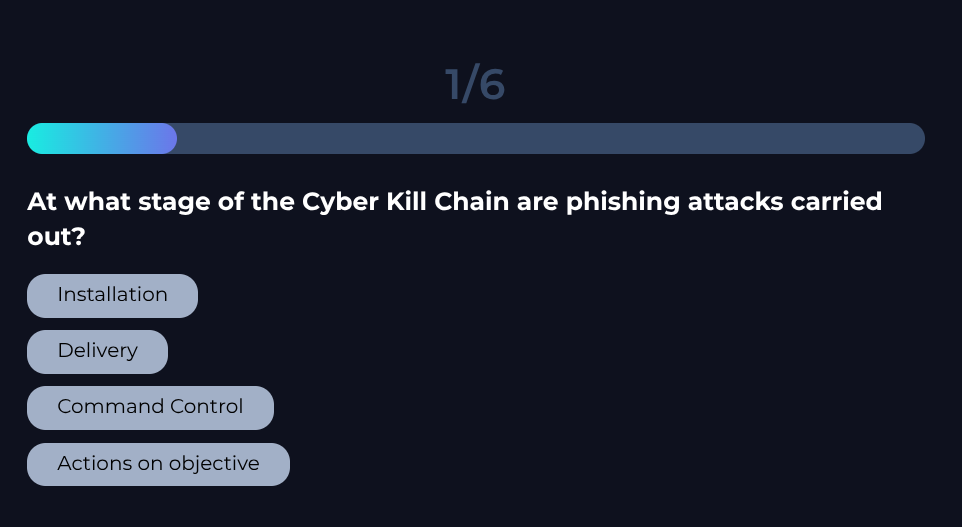
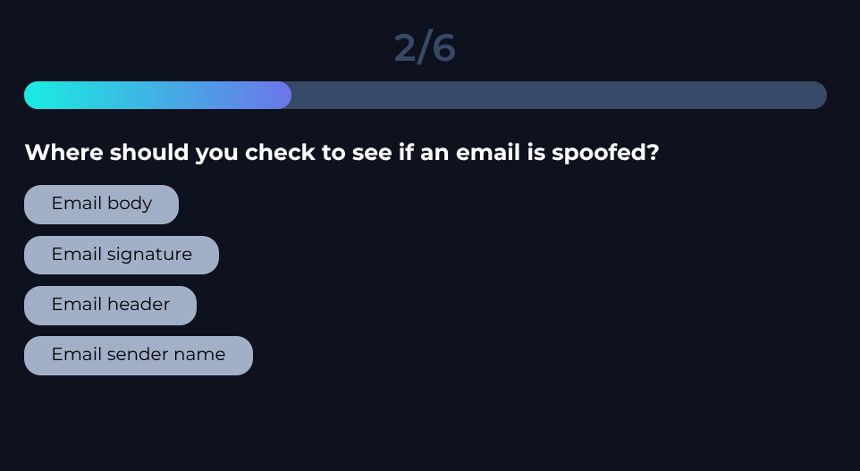
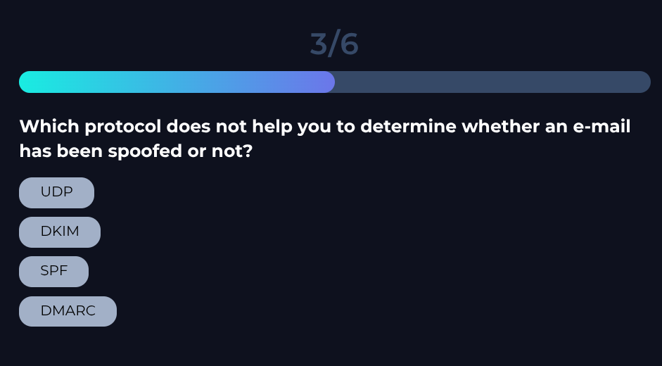
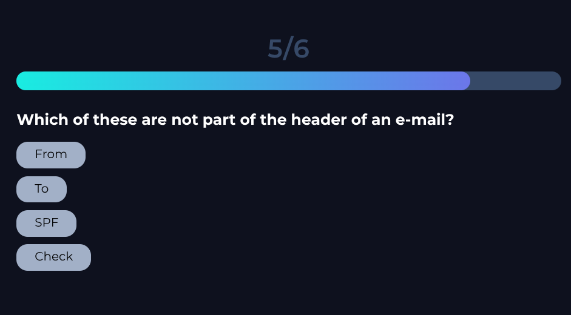
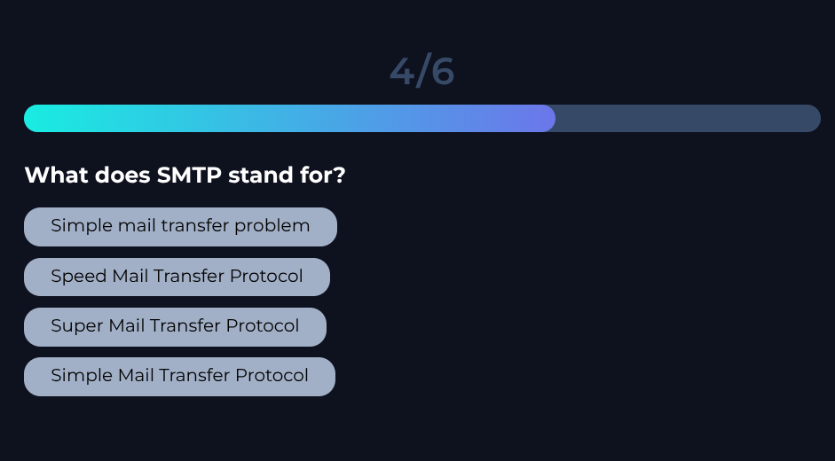
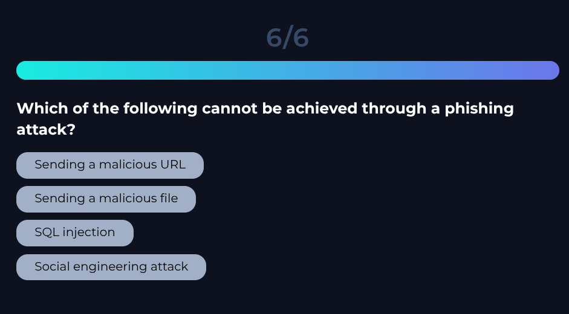

# Section 8: Phishing Quiz

The screenshots below show the quiz questions. Open each answer disclosure to
check the answer; answers are hidden by default.

## Question 1 of 6

Reveal answer

**Answer:** Delivery

## Question 2 of 6

Reveal answer

**Answer:** Email Header

## Question 3 of 6

Reveal answer

**Answer:** UDP

## Question 4 of 6

Reveal answer

**Answer:** Simple Mail Transfer Protocol

## Question 5 of 6

Reveal answer

**Answer:** Check

## Question 6 of 6

Reveal answer

**Answer:** SQL Injection

